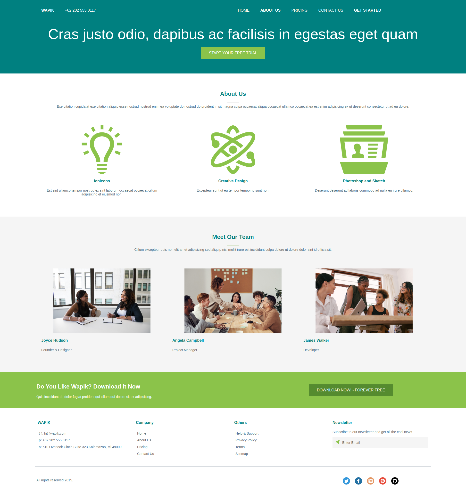

# Ejercicio Kubide
* Se ha empleado un repositorio git porque así hay trazabilidad en el código.
* Separo el código CSS en un documento CSS aparte para que el código quede estructurado (así evito que el CSS esté inline o en el mismo HTML).
* Los archivos estáticos (imágenes, logos y hojas de estilo) están en un directorio aparte STATIC.
* Los archivos HTML (index.html) se encuentran en un directorio aparte TEMPLATES.
* No he empleado Bootstrap, pero sí he empleado un CSS basado en flexbox layout para que sea responsive.
* Tanto el HTML como el CSS ha sido validados mediante los siguientes servicios de validación:
* HTML: https://validator.w3.org/
* CSS: https://jigsaw.w3.org/css-validator/
* Al ser responsive se adapta a distintos tipos de pantalla (se recomienda encarecidamente ajustar el ancho de la ventana del navegador para probarlo rápidamente).

## Pantallazo

